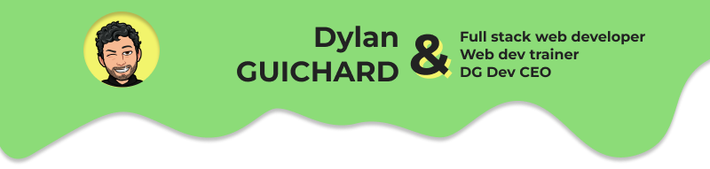

### 😎 Ce que je fais
- :computer: Développeur web depuis plus de 10 ans maintenant
- :mortar_board: Diplomé d'un Master (M2I) de développement informatique option jeu vidéo
- 👨‍💻 Professeur de developpement & coach projet, dans l'école ou j'ai été diplomé pour des élèves allant du BTS au Master
- :rocket: Freelance

### 💪 Ce que j'utilise déjà
- :eyes: Front : HTML/CSS/JS natif et framework (notamment Angular et Vue.js)
- :construction_worker: Back : Python (Django), Node.js
- :page_facing_up: BDD : SQL
- 🎨 Design : Figma 

### 💭 Ce que j'apprends
- :eyes: Front : React, Next.js
- :construction_worker: Back : Node.js
- :page_facing_up: BDD : MongoDb
- 🎨 Design : Canvas

### ❤️ Ce que j'aime dans la vie
- :family: La famille
- :beers: Les amis
- :fork_and_knife: La gastronomie
- :runner: Le sport
- :game_die: Le JDR

### 📫 Contact
- [Portfolio](http://dylan-guichard.me/)
- [Linkedin](https://www.linkedin.com/in/dylan-guichard-b054b9151/)

<!--
**dylanguichard/dylanguichard** is a ✨ _special_ ✨ repository because its `README.md` (this file) appears on your GitHub profile.

Here are some ideas to get you started:

- 🔭 I’m currently working on ...
- 🌱 I’m currently learning ...
- 👯 I’m looking to collaborate on ...
- 🤔 I’m looking for help with ...
- 💬 Ask me about ...
- 📫 How to reach me: ...
- 😄 Pronouns: ...
- ⚡ Fun fact: ...
-->
